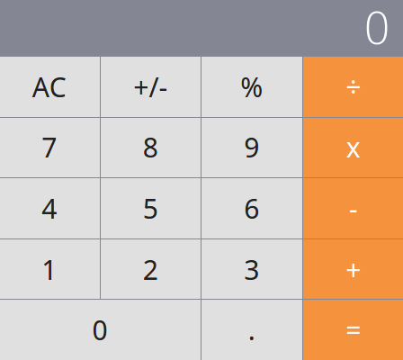
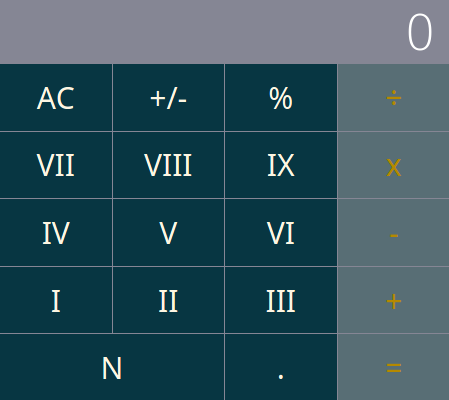
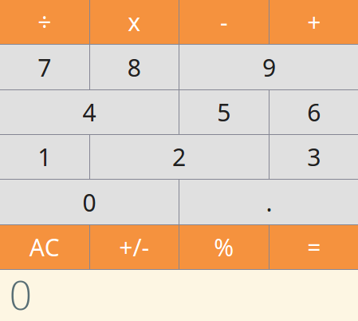

# What is it?

It's a simple React application, based on [this calculator](https://github.com/ahfarmer/calculator), showcasing how a white label app could be implemented with React and Webpack.

Have a look at [this blog post](https://medium.com/@jaroslaw.marek/white-label-web-app-with-reactjs-and-webpack-bb3a94a83fe6) for detailed explanation of how it works.

# Building

You can build three different versions of this app. One for each "brand": `calc_co`, `acme` and the default.

Obviously, before building it you need to run `npm install`.

## Default brand

`npm run build` will produce the following app. See it live [here](https://jar0s.github.io/react-webpack-wla/default/).

## Acme brand

`APP_BRAND=acme npm run buid` will produce the following app. See it live [here](https://jar0s.github.io/react-webpack-wla/acme/).

## Calc Co brand

`APP_BRAND=calc_co npm run buid` will produce the following app. See it live [here](https://jar0s.github.io/react-webpack-wla/calc_co/).

# Funding

If you like my work and thinking about using it in a commercial project, please consider [buying me a coffee](https://www.buymeacoffee.com/jar0s).
Thank you.